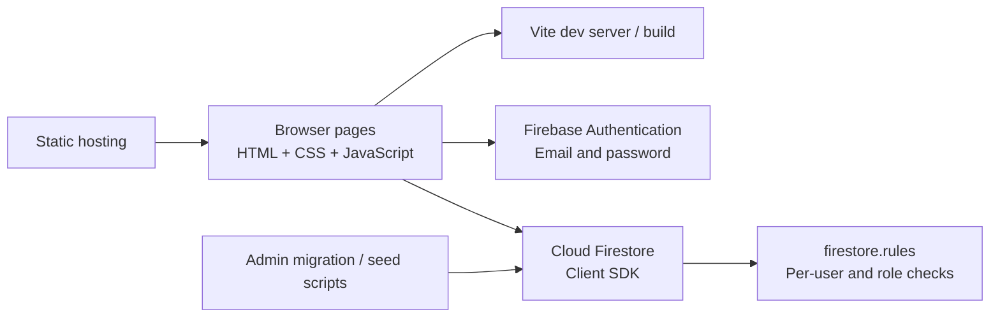

# KonkanStay Platform 🌊

A multi-page coastal-stay marketplace for the Konkan region of Maharashtra. The current customer-side checkout is an explicitly local browser feature; it does not charge, create a real reservation, or affect host inventory.

> **feature note:** Date availability, payment outcomes, holds, and feature confirmations are stored in this browser only. No money is charged and no real room is reserved. Firebase reauthentication verifies the signed-in account; the password is not stored by KonkanStay.

## ✨ Features

| Area | What it does |
| --- | --- |
| Discovery | Destination landing page, property search, filters, sorting, and property details |
| Traveler account | Firebase email/password registration, customer dashboard, map, and booking history |
| Host account | Host dashboard, listing creation, property photos, payment instructions, and booking review |
| Booking feature | Per-card availability status, date overlap check, 10-minute browser-local hold, simulated payment success/decline, Firebase password reauthentication, and a three-failure cancellation |
| feature confirmation | Save a browser-local feature booking and print a clearly watermarked confirmation; it is not a real booking, payment receipt, or invoice |
| Firebase | Authentication and Firestore persistence with client and server-side utility scripts |
| Responsive pages | Static HTML, CSS, and browser JavaScript bundled with Vite |

## 🧭 Pages and Routes

| Route | Audience | Purpose |
| --- | --- | --- |
| `/` | Everyone | Landing page, destination highlights, and search form |
| `/pages/search/search.html` | Everyone | Browse and filter listings; run the customer-side booking featurenstration |
| `/pages/login/login.html` | Everyone | Sign in with Firebase Authentication |
| `/pages/register/register.html` | Everyone | Create a traveler or host account |
| `/pages/dashboard-customer/dashboard-customer.html` | Travelers | Browse, view the map, track Firestore bookings and local feature bookings, and print confirmations |
| `/pages/dashboard-host/dashboard-host.html` | Hosts | Create listings and review legacy Firestore booking requests |
| `/pages/dashboard-host/dashboard-host.html?feature=host` | Everyone | Read-only host dashboard presentation with fictional sample properties and bookings |

## 🏗️ System Architecture



### Runtime Components

| Component | Responsibility | Location |
| --- | --- | --- |
| UI pages | Page structure, forms, modals, and navigation | [`index.html`](index.html), [`pages/`](pages) |
| Shared styles | Landing, search, auth, and dashboard styling | [`assets/css/`](assets/css) |
| Landing behavior | Navigation, date fields, profile menu, and auth-aware navbar | [`assets/js/main.js`](assets/js/main.js) |
| Public search and booking | Listing queries, filters, details, and traveler requests | [`assets/js/public.js`](assets/js/public.js) |
| Account forms | Registration and sign-in handlers | [`assets/js/auth.js`](assets/js/auth.js) |
| Dashboard behavior | Host and traveler data views and booking review | [`assets/js/dashboard.js`](assets/js/dashboard.js) |
| Firebase client | Firebase initialization, authentication, and Firestore access | [`assets/js/firebase/`](assets/js/firebase) |
| Booking helpers | Calendar-date validation, totals, local dates, and HTML escaping | [`assets/js/bookingUtils.mjs`](assets/js/bookingUtils.mjs) |
| Access policy | Firestore document-level authorization | [`firestore.rules`](firestore.rules) |
| Legacy-data migration | Dry-run-first move of private listing fields and safe-publication marker | [`scripts/migrateLegacyPropertyDetails.mjs`](scripts/migrateLegacyPropertyDetails.mjs) |
| Availability migration | Dry-run backfill of occupied nights from existing confirmed bookings | [`scripts/migrateConfirmedBookingAvailability.mjs`](scripts/migrateConfirmedBookingAvailability.mjs) |

### Data Model 🗃️

| Collection | Document ID | Key fields | Access |
| --- | --- | --- | --- |
| `users` | Firebase Auth UID | `uid`, `email`, `userType`, optional username/contact/profile fields | A signed-in user can read their own profile; profile enumeration and client updates are denied |
| `properties` | Firestore-generated ID | `title`, `location`, `price`, `guests`, `description`, `hostEmail`, image data/URLs, `createdAt`, `isPublic` | Public queries return only sanitized documents with `isPublic: true`; only hosts can create, and owners can update/delete |
| `properties/{propertyId}/availability/{YYYY-MM-DD}` | One document per occupied night | `bookingId`, `date`, `isPublic`, `occupied`, `createdAt` | Publicly readable date-only lock; owning host creates it atomically with booking confirmation |
| `properties/{propertyId}/availability/{YYYY-MM-DD}` | One document per occupied night | `bookingId`, `date`, `isPublic`, `occupied`, `createdAt` | Publicly readable date-only lock; only the owning host can create it atomically with booking confirmation |
| `propertyPrivateDetails` | Matching property ID | `hostEmail`, optional host name/phone and UPI/bank/QR instructions | Direct reads only for signed-in customers or the owning host; collection listing is denied |
| `bookings` | Firestore-generated ID | property snapshot, customer/host emails, dates, guests, nights, total, optional transaction reference, status | Only the customer and associated host can read; only the associated host can confirm or decline a pending request with a reference |

User profile fields are deliberately not used as a public directory. Government ID numbers are not collected by the current registration form. Do not add identity-document collection without a defined verification and retention process.

### Booking States 🔁

| State | Created by | Meaning |
| --- | --- | --- |
| `Requested` | Legacy records | No payment reference is attached; a host cannot confirm this state |
| `Pending verification` | Legacy Firestore flow | A transaction reference was submitted for host review |
| `Confirmed` | Legacy host flow | Host manually reviewed a reference; it is not processor verification |
| `feature confirmed` | Customer browser | Local-only simulated result; not written to Firestore or visible to the host |
| `Declined` | Host | Host rejected the request or payment reference |

The host revenue chart includes only Firestore `Confirmed` bookings. feature reservations are stored in local browser storage and do not affect host inventory or revenue. Their printable confirmation is watermarked as a feature.

## 🚀 Local Setup

### Requirements

| Requirement | Version / note |
| --- | --- |
| Node.js | 22.12+ recommended (Vite 8 requires a modern Node 20/22 release) |
| npm | Bundled with Node.js |
| Firebase project | Authentication and Cloud Firestore enabled for live features |

### Install and Run

1. Install packages:

   ```sh
   npm install
   ```

2. Create a local environment file by copying `.env.example` to `.env`, then fill in the Firebase web-app settings from Firebase Console → Project settings → Your apps.

3. In Firebase Console, enable **Authentication → Email/Password** and create a Firestore database.

4. Start the local site:

   ```sh
   npm run dev
   ```

5. Open the URL printed by Vite, usually `http://localhost:5173`.

The Firebase web API key is a client identifier, not an authorization boundary. Firestore rules provide access control. Keep Admin service-account credentials private and never commit `.env` or credential JSON files.

### Environment Variables 🔐

| Variable | Used by | Description |
| --- | --- | --- |
| `VITE_FIREBASE_API_KEY` | Browser | Firebase web app API key |
| `VITE_FIREBASE_AUTH_DOMAIN` | Browser | Firebase Authentication domain |
| `VITE_FIREBASE_PROJECT_ID` | Browser and utility scripts | Firebase project ID |
| `VITE_FIREBASE_STORAGE_BUCKET` | Browser | Firebase Storage bucket setting |
| `VITE_FIREBASE_MESSAGING_SENDER_ID` | Browser | Firebase project sender ID |
| `VITE_FIREBASE_APP_ID` | Browser | Firebase web app ID |
| `GOOGLE_APPLICATION_CREDENTIALS` | Migration utility | Path to a service-account JSON file, or configure Application Default Credentials another way |
| `SEEDER_EMAIL` / `SEEDER_PASSWORD` | Optional seed utility | Credentials for an existing host account |

Only variables prefixed with `VITE_` are embedded in the browser build. The seeder credentials and Admin credentials are read only by Node scripts.

## 🧰 Commands

| Command | Purpose | External access |
| --- | --- | --- |
| `npm run dev` | Start Vite development server | Firebase required for live data/auth |
| `npm run build` | Build all six HTML entry pages into `dist/` | No Firebase connection required |
| `npm test` | Run offline unit tests for booking helpers | None |
| `npm run test:rules` | Start the Firestore Emulator and test authorization rules | Java and emulator download on first run |
| `npm run check:firebase` | Read public property listings as a connectivity check | Firebase config and network required |
| `npm run seed:properties` | Seed feature listings using an existing host account | Firebase config, host credentials, network required |
| `npm run migrate:property-details` | Dry-run legacy private-field migration | Admin credentials and network required |
| `npm run migrate:booking-availability` | Dry-run backfill of nights for existing confirmed bookings | Admin credentials and network required |

To apply the migration after reviewing its dry-run output:

```sh
npm run migrate:property-details -- --apply
```

The migration moves legacy `hostName`, `hostPhone`, `upiId`, `bankAcc`, `bankIfsc`, and `qrCode` fields to `propertyPrivateDetails`, deletes them from listing documents, and adds `isPublic: true` only to records whose fields match the public listing schema. Records with government-ID fields or unrecognized fields are left unpublished for manual review. Dry-run output contains counts only; it does not print field values. Back up Firestore first.

## 🔒 Firestore Rules and Deployment

The app expects [`firestore.rules`](firestore.rules) to be deployed to the same Firebase project as the client configuration. [`firebase.json`](firebase.json) points Firebase CLI at that rules file.

For an existing database, use this order to avoid exposing legacy listing data after the rules change:

1. Back up the Firestore database.
2. Configure Google Application Default Credentials or set `GOOGLE_APPLICATION_CREDENTIALS` in `.env` to an Admin service-account JSON file. Never add that file to Git.
3. Run `npm run migrate:property-details` and review the safe-to-publish and held-back document counts.
4. Run `npm run migrate:property-details -- --apply`; inspect and resolve held-back records before expecting them to appear in search.
5. Run `npm run migrate:booking-availability` and review invalid/overlapping booking counts.
6. Run `npm run migrate:booking-availability -- --apply` and resolve skipped conflicts before enabling new confirmations.
7. Deploy rules with an authenticated Firebase CLI account:

   ```sh
   firebase deploy --only firestore:rules --project YOUR_FIREBASE_PROJECT_ID
   ```

8. Build and deploy the `dist/` directory to your chosen static host.

New properties write listing and private details atomically. Host-confirmed Firestore bookings claim every occupied night in a single transaction; concurrent overlapping confirmations conflict. feature reservations remain browser-local and are not global inventory. Existing confirmed bookings need the availability backfill before deployment. If legacy listings still contain private fields, anonymous listing queries will be denied until they are migrated.

## 🧪 Verification

```sh
npm test
npm run test:rules
npm run build
npm audit --omit=dev
```

The test suite is intentionally offline. `scripts/test-firebase.mjs` is a separate live connectivity check and is not included in `npm test`.

## 📦 Build and Hosting

`npm run build` generates `dist/index.html` and all five pages under `dist/pages/`, plus bundled styles and assets. Configure the static host to publish `dist/` and preserve the relative `/pages/...` paths. The home page includes a hero video; it is metadata-preloaded to reduce eager transfer.

## ⚠️ Current Boundaries

| Boundary | Current behavior | Production follow-up |
| --- | --- | --- |
| Payments | Search checkout only simulates success/decline; no money moves and no gateway is called | Integrate a payment provider and trusted server-side webhook verification |
| Availability | Confirmed Firestore bookings reserve shared per-night locks; local feature bookings/holds remain browser-only. A client-side feature payment does not reserve global inventory | Use a trusted payment backend to create customer reservations and guarantee payment+inventory atomically |
| Price calculation | Client computes nights and total; rules verify total against the submitted nights and listing rate | Recompute all booking values in trusted server code before confirmation |
| Images | Up to three compressed images are stored in Firestore documents | Move image binaries to Firebase Storage and store download URLs |
| Rules tests | Firebase Emulator Suite tests cover access and booking constraints | Run `npm run test:rules` in CI and deploy the tested rules with the app |
| Refund and booking emails | No feature refund occurs because the simulated payment takes no money; Firebase Authentication handles password-reset emails | Add a trusted email service or Cloud Function triggered by verified payment/refund events |
| Payment and identity controls | Firebase reauthentication is real; the math CAPTCHA and three-attempt feature cancellation are client-side only | Add a payment provider with webhook verification plus trusted CAPTCHA/rate-limit enforcement before production |
| Reservation PDF | feature print view is watermarked and explicitly not a real reservation; legacy host-confirmed records retain their reservation summary | Generate an invoice only from server-verified payment and booking records |
| External assets | Fonts, Leaflet tiles, and Chart.js use external services/CDNs | Pin or self-host dependencies and review availability/privacy requirements |

This repository is a functional prototype. Treat authentication, Firestore rules, deployment configuration, payment confirmation, and booking availability as separate production-readiness gates.
